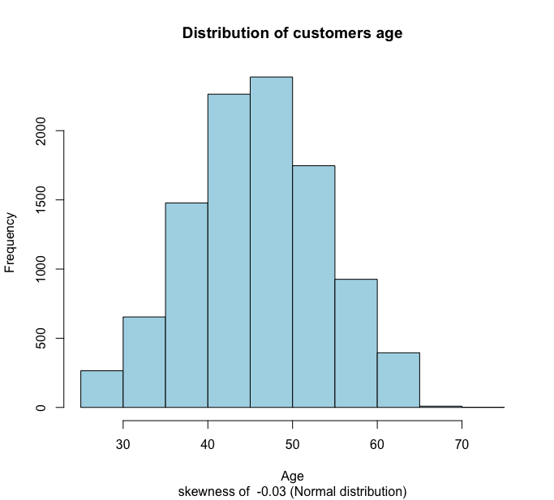
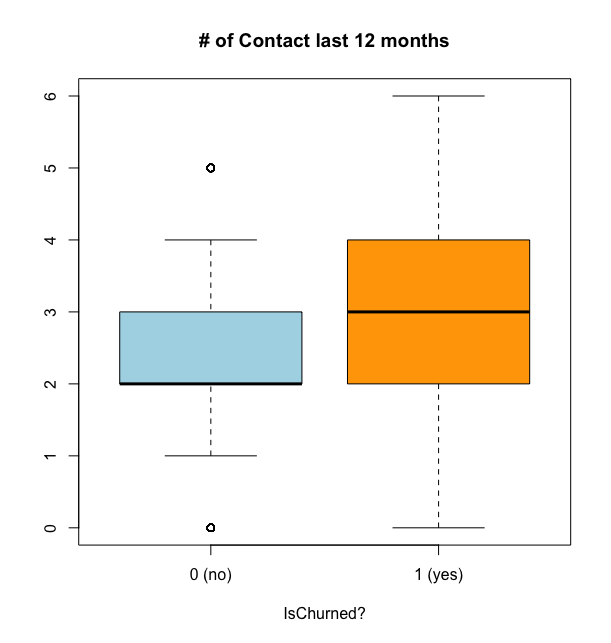
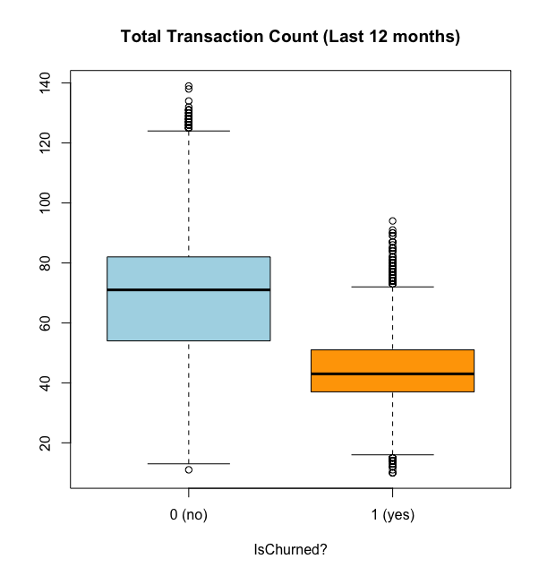

# Predict churning customer: Overview

* Created a model in order to identify customers who have more likelihood to leave. The idea is predict who is going to churn and then create some marketing actions like offering better services or some discount services. 
* Dataset has more than 10.000 observations, 20 variables and approximately 16% of churning 
* It was utilized Logistic regression model 

## Exploratory Data Analysis

I analyzed all the features distributions of the data. I applied **univariate** and **bivariate analysis** in order to explore de data and understand the distribution behaviors. Below are a few highlights from the exploration analysis.

 

## Model Building 

In order to solve this business problem, I chose the **logistic regression model** because it is model very well accepted *(benchmark)* in the companies. Some of the reasons are because the model gives a **probability as an output** (classification model) where you can create **groups of probabilities** to focus on a specific slice and also because it is **easy to interpret the output** in order to explain what is happenning.

Steps applied to create the model:

* The target variable was transformed as **bynary** type
* The dataset were splitted between train **(70%)** and test **(30%)**.
* **Information Value (IV)** technique was applied to check the predictive power of independent variables against the target variable
* **Dimensionality reduction** technique was applied utilizing **backward** technique with **10% of significance** and **IV > 0.03**
* After create the model, I checked the **multicollinearity** between the variables assuming **VIF > 5**

## Model performance 

It were used **confusion matrix** and **ROC curve** technique to validate and test peformance.

## Data Dictionary 

| Feature     |     Type    |  Description | 
| ----------- | ----------- | ----------- |
| Clientnum       |Num       | Client number. Unique identifier for the customer holding the account         |
| Attrition_Flag  |Char| Internal event (customer activity) variable       |
| Customer_Age    |Num | Customer's Age in Years |
| Gender          |Char| M=Male, F=Female |
| Dependent_count |Num | Number of dependents |
| Education_Level |Char| Educational Qualification of the account holder (example: high school, college graduate, etc.)|
| Marital_Status  |Char| Married, Single, Unknown | 
| Income_Category |Char| Annual Income Category (< $40K, $40K - 60K, $60K - $80K, $80K-$120K, > $120K, Unknown)|
| Card_Category   |Char| Type of Card (Blue, Silver, Gold, Platinum) |
| Months_on_book  |Num| Months on book (Time of Relationship) |
| Total_Relationship_Count |Num| Total no. of products held by the customer |
| Months_Inactive_12_mon|Num|Total no. of products held by the customer |
| Contacts_Count_12_mon |Num| No. of Contacts in the last 12 months |
| Credit_Limit |Num| Credit Limit on the Credit Card |
| Total_Revolving_Bal|Num| Total Revolving Balance on the Credit Card | 
| Avg_Open_To_Buy |Num| Open to Buy Credit Line (Average of last 12 months) |
| Total_Amt_Chng_Q4_Q1 |Num| Change in Transaction Amount (Q4 over Q1) |
| Total_Trans_Amt |Num| Total Transaction Amount (Last 12 months)|
| Total_Trans_Ct |Num| Total Transaction Count (Last 12 months)|
| Total_Ct_Chng_Q4_Q1 |Num| Change in Transaction Count (Q4 over Q1) |
| Avg_Utilization_Ratio |Num| Average Card Utilization Ratio |

## Source

It was used a dataset from Kaggle [Credit Card customer](https://www.kaggle.com/sakshigoyal7/credit-card-customers).

